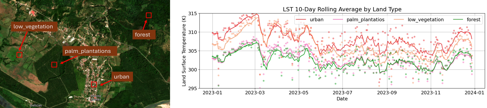
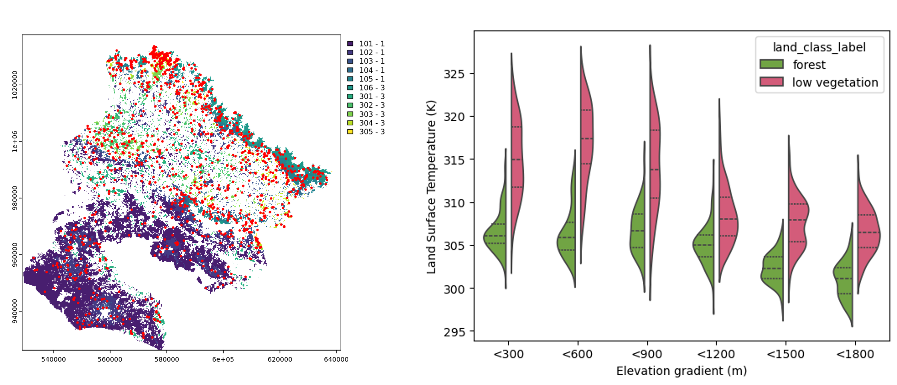

## Acknowledgments
This work was financed by [OSA Conservation](https://osaconservation.org/). Planet imagery were provided through the [Centinela Project](https://www.planet.com/project-centinela/).

# Repository overview
## 📓 Notebooks

### 1. `01_demo_polygons.ipynb`
- A minimal working demo that shows how to request LST Planet data from Sentinel Hub.
- Obtains daily LST data accoss a single year for four small polygons of different landcover types.
- Includes visualization of timeseries LST data.

 

### 2. `02_osa_case_study.ipynb`
- A case study focused on the Osa Peninsula, Costa Rica.
- Retrieves LST data for 1200 sampling areas.
- Compares LST profiles of two landcover classes for a single date.

 

## 🧰 Modules

### `helpers.py`
Contains reusable functions:
- `authenticate_sentinel_hub(client_id, client_secret)` — Authenticates with Sentinel Hub and returns a session. Returns an `OAuth2Session` object with the authentication token for authorized API requests.
- `build_json_request(geometry, start_date, end_date, day_interval, data_set)`**  
  Constructs a JSON payload for querying the Sentinel Hub Statistical API.  
  Takes in:
  - `geometry`: The spatial feature to query (e.g., from a GeoDataFrame)  
  - `start_date`, `end_date`: Analysis time range in `YYYY-MM-DD` format  
  - `day_interval`: Temporal resolution (e.g., `1` for daily statistics)  
  - `data_set`: The specific dataset to query (e.g., LST)

- `stats_to_df(response_json)`**  
  Parses a Statistical API JSON response and transforms it into a `pandas.DataFrame`.  


### `utils.py`
Houses global variables and the evalscript:

- `evalscript`  
  This script defines how Sentinel Hub should process and return the data. It is written in a JavaScript-like language and is passed with each request to the API.  
  The current `evalscript` performs the following:

  - Filters scenes based on **local solar time**, specifically selecting observations made at **13:30** (can be changed to 01:30 or left open)
  - Extracts the **Land Surface Temperature (LST)** values and applies a **scale factor of 1/100**
  - Filters out invalid pixels using the **dataMask**
  - Returns data in a format compatible with **Statistical API** output for numerical analysis (via `eobrowserStats`)

## 🛠️ Getting Started

1. Clone the repo
2. Set up your virtual environment and install dependencies:
    ```bash
    pip install -r requirements.txt
    ```
3. Add your Sentinel Hub credentials (client ID & secret) in the appropriate cell or config file.
4. Run the desired notebook.
